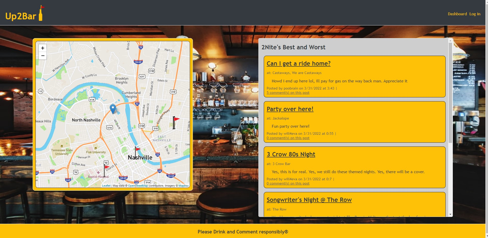

# up2bar

## Premise

Webpage where bar-seekers can seek bars in their present or future locations

## Outline

- At the homepage, users can see the most recent posts as well as a map showing pins for those posts.
- At the top of the page the user can click the 'Up2Bar' logo to return to the homepage, the dashboard button to see their own posts/create a new one, or the login/logout button depending on if they are logged in or not.
- If the user is not logged in, clicking on dashboard or login will both redirect them to the login/sign-up page where they will be able to log in with an existing profile or create a new one.
- Once the user is logged in, the will be directed to their dashboard where they can edit or delete existing posts, or create new ones.
- As a logged in user, they can also comment on other's posts by clicking on the post title in the homepage and adding a comment.

## Built With

- SQL
- Express
- Handlebars
- MapQuest Geocoding API
- Leaflet
- OpenStreetMaps

## Webpage

https://up2bar.herokuapp.com/

## Screenshot

## Contribution

- wingram1
- joshlyons225
- j-maclellan
